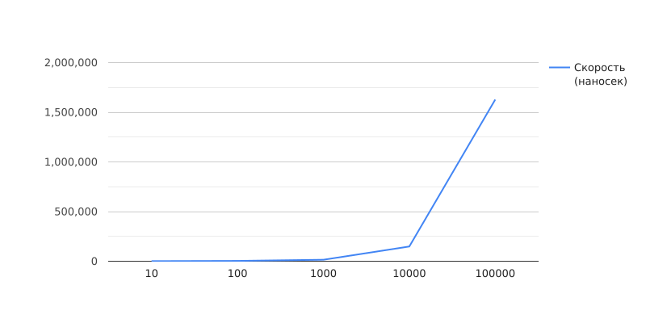
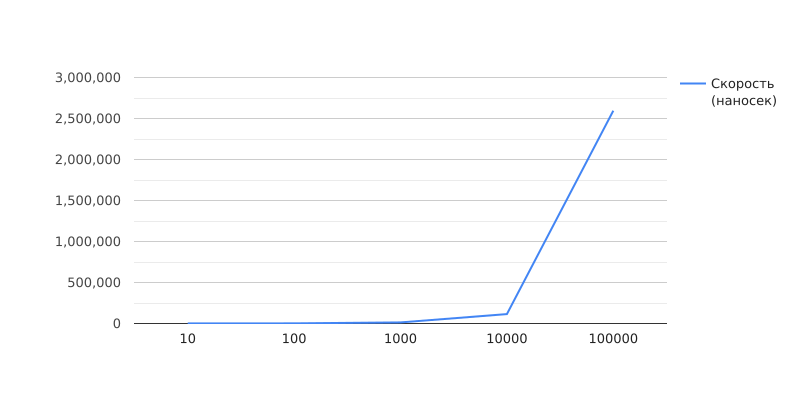
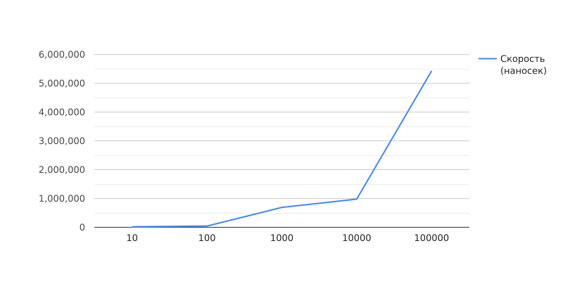
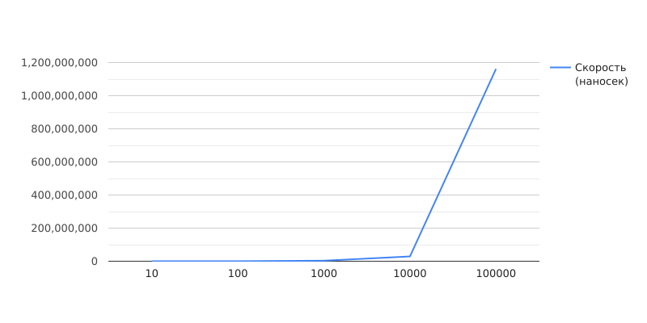

# NumberProcessor

Простая программа на Java для обработки чисел из файла.

## Функциональность

- Чтение чисел из файла.
- Поиск минимального и максимального числа.
- Расчет суммы и произведения чисел.

## Как использовать

1. Укажите путь к файлу с числами.
2. Запустите программу.
3. Результаты будут выведены в консоль.

## Графики зависимости скорости выполнения от количества чисел
<figure>
    <figcaption>Скорость min функции</figcaption>
    
    <figcaption>Скорость max функции</figcaption>
    
    <figcaption>Скорость sum функции</figcaption>
    
    <figcaption>Скорость mult функции</figcaption>
    
</figure>

